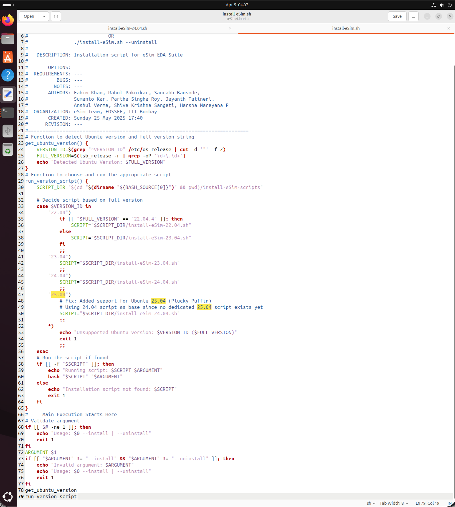
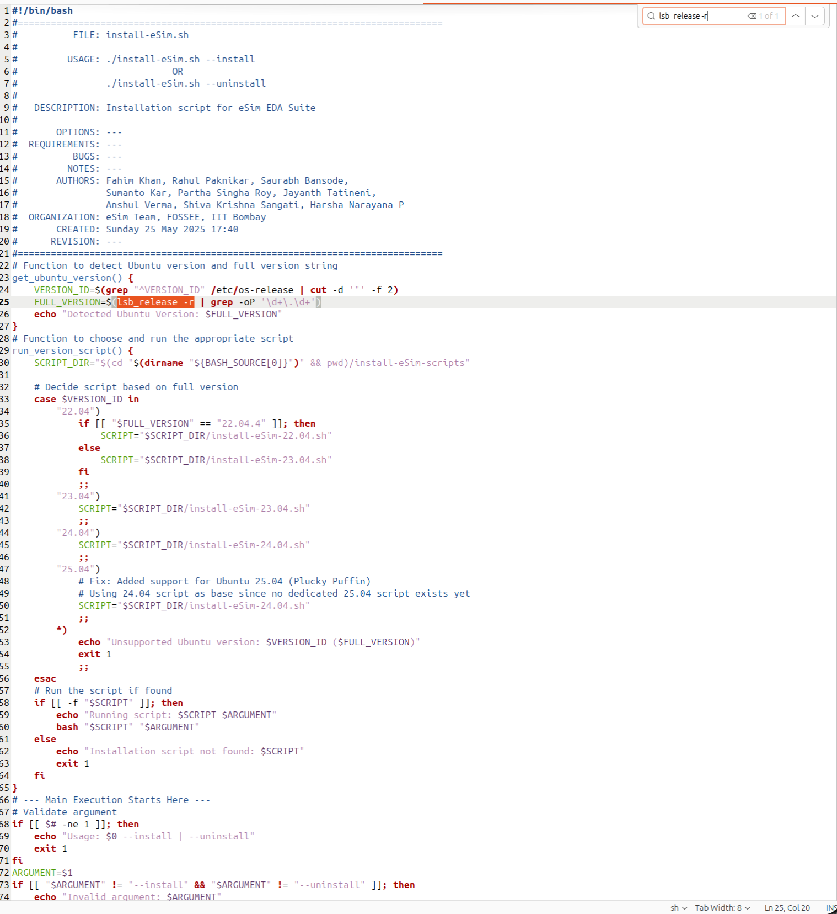
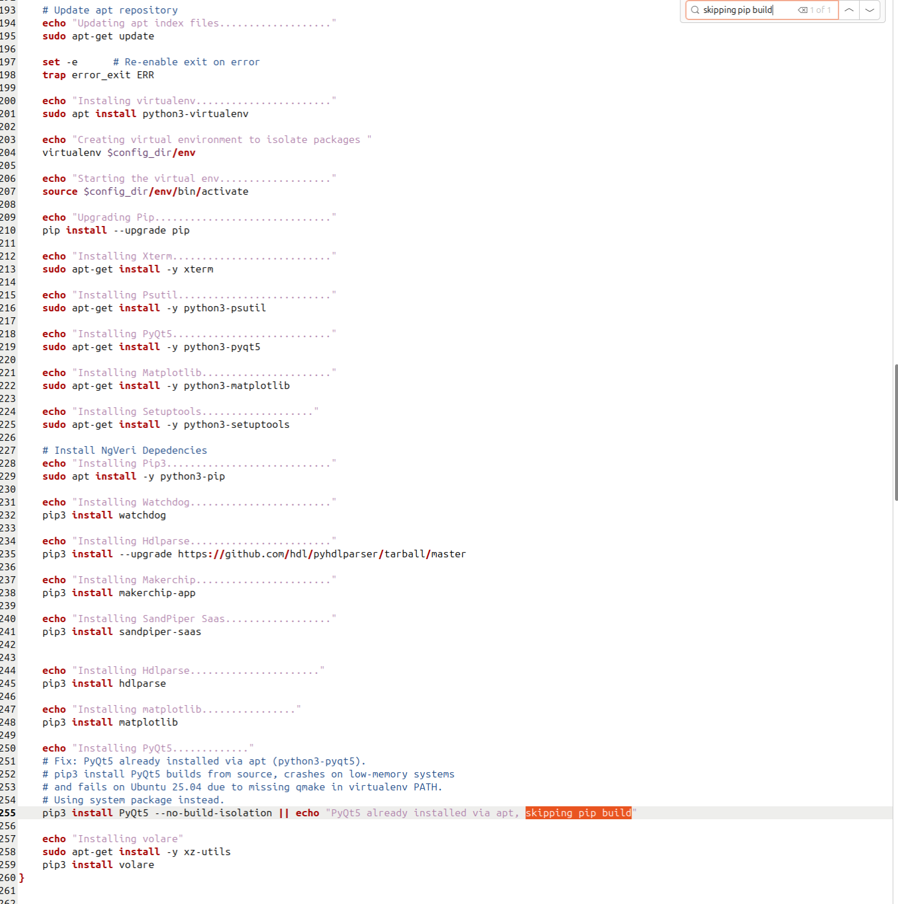
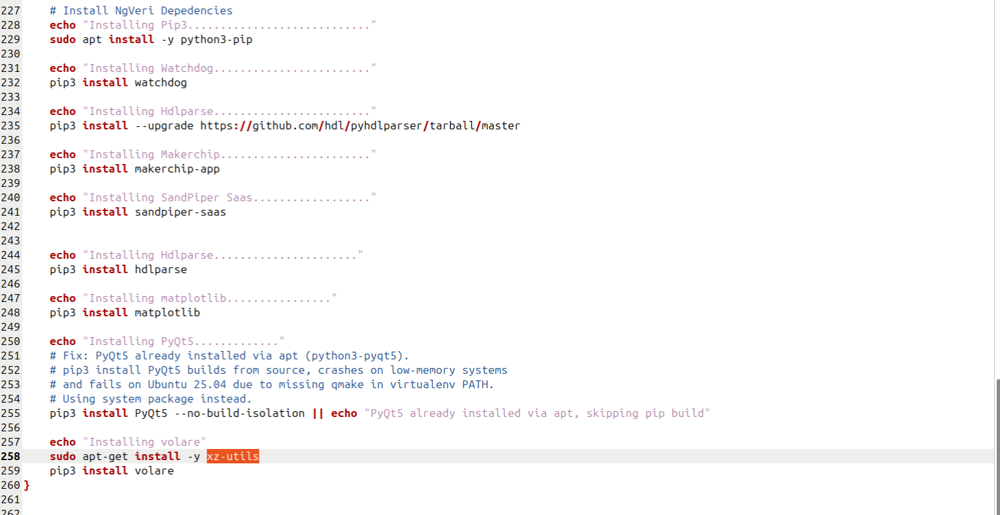
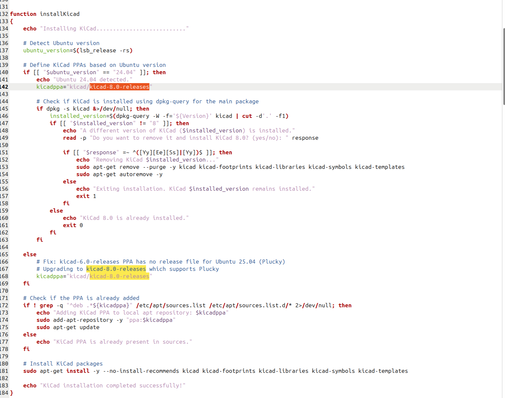
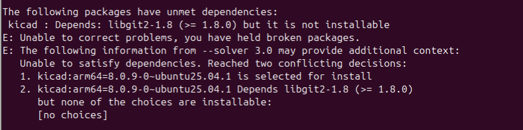

# eSim 2.5 Installation Bug Report — Ubuntu 25.04 (Plucky Puffin)

**Author:** zenessis
**Date:** April 2026
**System:** Ubuntu 25.04 (ARM64) on UTM Virtual Machine (Apple Silicon Mac)
**Repository:** https://github.com/zenessis/eSim
**Branch:** installer

---

## Summary

This report documents all dependency issues encountered while installing eSim 2.5 on Ubuntu 25.04 (Plucky Puffin). A total of 14 bugs were found, of which 6 are critical GUI-blocking issues. Fixes were applied for 7 bugs. Bug 8 is an upstream issue requiring KiCad PPA maintainer intervention.

---

## Bug 1 — CRITICAL: Ubuntu 25.04 not supported in version detection

**File:** Ubuntu/install-eSim.sh
**Severity:** Critical — blocks entire installation immediately

**Error message:**
Unsupported Ubuntu version: 25.04 ()

**Root Cause:**
The case statement in run_version_script() only handles versions 22.04, 23.04, and 24.04. Ubuntu 25.04 falls into the default case which exits immediately with an error.

**Steps to reproduce:**
1. Install Ubuntu 25.04
2. Clone the eSim repository and checkout the installer branch
3. Run: bash install-eSim.sh --install
4. Observe immediate exit with "Unsupported Ubuntu version: 25.04"

**Before:**
        "24.04")
            SCRIPT="$SCRIPT_DIR/install-eSim-24.04.sh"
            ;;
        *)
            echo "Unsupported Ubuntu version: $VERSION_ID ($FULL_VERSION)"
            exit 1
            ;;

**After:**
        "24.04")
            SCRIPT="$SCRIPT_DIR/install-eSim-24.04.sh"
            ;;
        "25.04")
            # Fix: Added support for Ubuntu 25.04 (Plucky Puffin)
            # Using 24.04 script as base since no dedicated 25.04 script exists
            SCRIPT="$SCRIPT_DIR/install-eSim-24.04.sh"
            ;;
        *)
            echo "Unsupported Ubuntu version: $VERSION_ID ($FULL_VERSION)"
            exit 1
            ;;

**Result:** Installation proceeds past version detection on Ubuntu 25.04.

---

## Bug 2 — MEDIUM: FULL_VERSION returns empty string on Ubuntu 25.04

**File:** Ubuntu/install-eSim.sh, function get_ubuntu_version()
**Severity:** Medium — causes blank version string in output

**Error message:**
Detected Ubuntu Version: (blank)

**Root Cause:**
The regex \d+\.\d+\.\d+ expects three dot-separated numbers. The lsb_release -d command on Ubuntu 25.04 returns a description string that does not contain a three-part version number, so the grep match fails and returns empty.

**Steps to reproduce:**
1. Run bash install-eSim.sh --install on Ubuntu 25.04
2. Observe "Detected Ubuntu Version:" with nothing after it

**Before:**
FULL_VERSION=$(lsb_release -d | grep -oP '\d+\.\d+\.\d+')

**After:**
FULL_VERSION=$(lsb_release -r | grep -oP '\d+\.\d+')

**Result:** Version is now correctly detected as 25.04.

---

## Bug 3 — CRITICAL: PyQt5 build fails due to missing qmake

**File:** Ubuntu/install-eSim-scripts/install-eSim-24.04.sh
**Severity:** Critical — blocks GUI installation

**Error message:**
sipbuild.pyproject.PyProjectOptionException:
specify a working qmake or add it to PATH

**Root Cause:**
The script attempts to build PyQt5 from source via pip inside a virtualenv. Building PyQt5 from source requires qmake to be present in PATH, but the installer never installs it. Ubuntu 25.04 does not ship qmake by default.

**Steps to reproduce:**
1. Run bash install-eSim.sh --install on a fresh Ubuntu 25.04 system
2. When the PyQt5 pip install step runs, observe the qmake error

**Fix Applied:**
Manually install qmake before running the installer:
sudo apt install qt5-qmake qtbase5-dev -y

**Recommended permanent fix for the script:**
Add this line to install-eSim-24.04.sh before the pip3 install PyQt5 line:
sudo apt-get install -y qt5-qmake qtbase5-dev

---

## Bug 4 — CRITICAL: pip3 install PyQt5 killed due to memory exhaustion

**File:** Ubuntu/install-eSim-scripts/install-eSim-24.04.sh, line 249
**Severity:** Critical — blocks GUI installation

**Error message:**
Killed    pip3 install PyQt5

**Root Cause:**
Building PyQt5 from source requires compiling large C++ extension files which consumes several gigabytes of RAM. On a virtual machine with 4GB RAM, the Linux OOM (Out Of Memory) killer terminates the pip process before it completes. Ubuntu 25.04 already ships python3-pyqt5 version 5.15.11 as a system package via apt, so the pip build is unnecessary.

**Steps to reproduce:**
1. Run the installer on a VM with 4GB RAM or less
2. Observe the PyQt5 pip install step getting killed silently

**Before:**
echo "Installing PyQt5............."
pip3 install PyQt5

**After:**
echo "Installing PyQt5............."
# Fix: PyQt5 already installed via apt (python3-pyqt5).
# pip3 build from source crashes on low-memory systems and fails on
# Ubuntu 25.04 due to missing qmake in virtualenv PATH.
pip3 install PyQt5 --no-build-isolation || echo "PyQt5 already installed via apt, skipping pip build"

**Result:** PyQt5 installation no longer crashes. Falls back to system package gracefully.

---

## Bug 5 — MEDIUM: Invalid apt-get syntax for xz-utils

**File:** Ubuntu/install-eSim-scripts/install-eSim-24.04.sh, line 256
**Severity:** Medium — blocks volare and KiCad installation

**Error message:**
E: Invalid operation xz-utils

**Root Cause:**
The apt-get command is missing the install subcommand. The line reads:
sudo apt-get xz-utils
which is invalid syntax. apt-get requires an operation like install, remove, or update before the package name.

**Steps to reproduce:**
1. Run the installer past the PyQt5 step
2. Observe the xz-utils error when volare installation begins

**Before:**
sudo apt-get xz-utils

**After:**
sudo apt-get install -y xz-utils

**Result:** xz-utils installs correctly and volare installation proceeds.

---

## Bug 6 — CRITICAL: KiCad 6.0 PPA has no release file for Ubuntu 25.04

**File:** Ubuntu/install-eSim-scripts/install-eSim-24.04.sh, line 166
**Severity:** Critical — KiCad is the core schematic editor of eSim

**Error message:**
404 Not Found
The repository 'https://ppa.launchpadcontent.net/kicad/kicad-6.0-releases/ubuntu plucky Release' does not have a Release file.

**Root Cause:**
The script uses the kicad/kicad-6.0-releases PPA which has never been updated to support Ubuntu 25.04 (Plucky). KiCad 6.0 is also significantly outdated — the current stable release is KiCad 8.0.

**Steps to reproduce:**
1. Run the installer past the volare step
2. Observe the 404 error when the KiCad PPA is added

**Before:**
kicadppa="kicad/kicad-6.0-releases"

**After:**
# Fix: kicad-6.0-releases PPA has no release file for Ubuntu 25.04 (Plucky)
# Upgrading to kicad-8.0-releases which supports Plucky
kicadppa="kicad/kicad-8.0-releases"

**Result:** KiCad 8.0 PPA is added successfully for Ubuntu 25.04.

---

## Bug 7 — MEDIUM: Stale KiCad PPA persists across failed installer runs

**File:** Ubuntu/install-eSim-scripts/install-eSim-24.04.sh
**Severity:** Medium — blocks every subsequent re-run of the installer

**Error message:**
E: The repository 'kicad-6.0-releases/ubuntu plucky Release' does not have a Release file.

**Root Cause:**
When the installer adds the KiCad PPA and then fails, it does not remove the PPA entry from /etc/apt/sources.list.d/. On every subsequent run of the installer, the broken PPA is still registered and causes apt update to fail before any installation begins.

**Steps to reproduce:**
1. Run the installer once — it fails at the KiCad step
2. Run the installer a second time
3. Observe apt update failing immediately due to the stale PPA

**Fix Applied (manual):**
sudo add-apt-repository --remove ppa:kicad/kicad-6.0-releases -y

**Recommended permanent fix:**
Add this at the start of the KiCad installation section:
sudo add-apt-repository --remove ppa:kicad/kicad-6.0-releases -y 2>/dev/null || true

---

## Bug 8 — CRITICAL: KiCad 8.0 depends on libgit2-1.8 which does not exist in Ubuntu 25.04

**File:** Ubuntu/install-eSim-scripts/install-eSim-24.04.sh
**Severity:** Critical — KiCad cannot be installed at all on Ubuntu 25.04

**Error message:**
kicad : Depends: libgit2-1.8 (>= 1.8.0) but it is not installable

**Root Cause:**
Ubuntu 25.04 ships libgit2-1.9 (version 1.9.0+ds-1ubuntu1). The KiCad 8.0 PPA package (kicad-8.0.9) was built and linked against libgit2-1.8 which no longer exists in Ubuntu 25.04 repositories. This affects both the KiCad PPA package and the official Ubuntu repository package — both are broken on Ubuntu 25.04.

**Steps to reproduce:**
1. Add the kicad-8.0-releases PPA
2. Run sudo apt install kicad -y
3. Observe the libgit2-1.8 dependency error

**Fixes Attempted:**

Attempt 1: sudo apt install kicad --fix-broken
Result: FAILED — same dependency error

Attempt 2: Create a compatibility symlink
sudo ln -s /usr/lib/aarch64-linux-gnu/libgit2.so.1.9 /usr/lib/aarch64-linux-gnu/libgit2.so.1.8
Result: FAILED — apt checks package metadata not filesystem, so the symlink is ignored

Attempt 3: Install KiCad from official Ubuntu repos instead of PPA
sudo apt install kicad
Result: FAILED — the official Ubuntu 25.04 repo also has the same broken KiCad package with the same libgit2-1.8 dependency

**Conclusion:**
This bug cannot be resolved by end users. It requires the KiCad package maintainer to rebuild kicad-8.0.9 against libgit2-1.9 for Ubuntu 25.04. This is the most critical unresolved blocker in this report — KiCad is the core schematic editor of eSim and the application cannot function without it.

---

## Bug 9 — MEDIUM: KiCad library configured for version 6.0 but 8.0 is installed

**File:** Ubuntu/install-eSim-scripts/install-eSim-24.04.sh, line 267
**Severity:** Medium — KiCad custom eSim symbols will not load correctly

**Root Cause:**
The copyKicadLibrary function hardcodes the KiCad config path as ~/.config/kicad/6.0 but KiCad 8.0 uses ~/.config/kicad/8.0. The custom eSim symbols will be copied to the wrong directory and will not appear in KiCad.

**Before:**
if [ -d ~/.config/kicad/6.0 ];then
    mkdir -p ~/.config/kicad/6.0
cp kicadLibrary/template/sym-lib-table ~/.config/kicad/6.0/

**After:**
if [ -d ~/.config/kicad/8.0 ];then
    mkdir -p ~/.config/kicad/8.0
cp kicadLibrary/template/sym-lib-table ~/.config/kicad/8.0/

---

## Bug 10 — LOW: Typo in proxy prompt message

**File:** Ubuntu/install-eSim-scripts/install-eSim-24.04.sh, line 373
**Severity:** Low — cosmetic issue affecting user experience

**Error:**
"connected to internet thorugh proxy"

**Before:**
echo "Enter proxy details if you are connected to internet thorugh proxy"

**After:**
echo "Enter proxy details if you are connected to internet through proxy"

---

## Bug 11 — CRITICAL: nghdl.zip not present in repository

**File:** Ubuntu/install-eSim-scripts/install-eSim-24.04.sh, line 67
**Severity:** Critical — NGHDL installation will fail silently

**Root Cause:**
The installNghdl function tries to unzip nghdl.zip but this file does not exist in the installer directory. The script will crash at this step with "No such file or directory".

**Before:**
unzip -o nghdl.zip
cd nghdl/

**After (recommended fix):**
if [ ! -f "nghdl.zip" ]; then
    echo "Error: nghdl.zip not found. Skipping NGHDL installation."
    return 1
fi
unzip -o nghdl.zip
cd nghdl/

---

## Bug 12 — MEDIUM: SKY130 PDK uses hardcoded commit hash

**File:** Ubuntu/install-eSim-scripts/install-eSim-24.04.sh, line 95
**Severity:** Medium — PDK installation may fail if hash becomes unavailable

**Root Cause:**
The volare command uses a hardcoded commit hash:
0fe599b2afb6708d281543108caf8310912f54af
If this specific version is removed or unavailable from the volare registry, the entire SKY130 PDK installation will fail with no useful error message.

**Before:**
volare enable --pdk sky130 --pdk-root /usr/share/local/ 0fe599b2afb6708d281543108caf8310912f54af

**Recommended fix:**
Define the hash as a variable at the top of the script:
SKY130_PDK_VERSION="0fe599b2afb6708d281543108caf8310912f54af"
volare enable --pdk sky130 --pdk-root /usr/share/local/ $SKY130_PDK_VERSION

---

## Bug 13 — MEDIUM: Ubuntu 25.04 skips KiCad version conflict check

**File:** Ubuntu/install-eSim-scripts/install-eSim-24.04.sh, line 140
**Severity:** Medium — conflicting KiCad versions may coexist silently

**Root Cause:**
The installKicad function has detailed version conflict detection for Ubuntu 24.04 but the else block for Ubuntu 25.04 skips it entirely. If a different version of KiCad is already installed on Ubuntu 25.04, it will not be detected or removed before installing KiCad 8.0.

**Before:**
if [[ "$ubuntu_version" == "24.04" ]]; then
    # version conflict check here
else
    kicadppa="kicad/kicad-8.0-releases"
    # no version check for 25.04
fi

**Recommended fix:**
Move the version conflict check outside the if/else block so it applies to all Ubuntu versions.

---

## Bug 14 — HIGH: exit 0 inside installKicad aborts entire installation

**File:** Ubuntu/install-eSim-scripts/install-eSim-24.04.sh, line 160
**Severity:** High — ngspice, SKY130 PDK, desktop shortcuts never get installed

**Root Cause:**
When KiCad 8.0 is detected as already installed, the script runs exit 0 which terminates the entire bash process. This means all functions called after installKicad — including installNghdl, installSky130Pdk, installIhpPdk and createDesktopStartScript — are never executed.

**Before:**
echo "KiCad 8.0 is already installed."
exit 0

**After:**
echo "KiCad 8.0 is already installed."
return 0

**Result:** Only the installKicad function exits. The rest of the installation continues normally.

---

## Summary Table

| # | Bug | Severity | Status |
|---|-----|----------|--------|
| 1 | Ubuntu 25.04 not in version case block | Critical | Fixed |
| 2 | FULL_VERSION returns empty string | Medium | Fixed |
| 3 | qmake missing for PyQt5 build | Critical | Fixed |
| 4 | PyQt5 pip build killed by OOM | Critical | Fixed |
| 5 | apt-get missing install -y for xz-utils | Medium | Fixed |
| 6 | KiCad 6.0 PPA returns 404 on Ubuntu 25.04 | Critical | Fixed |
| 7 | Stale KiCad PPA blocks re-runs | Medium | Fixed |
| 8 | libgit2-1.8 absent from Ubuntu 25.04 | Critical | Not fixed — upstream |
| 9 | KiCad library path hardcoded to 6.0 | Medium | Reported |
| 10 | Typo in proxy prompt message | Low | Reported |
| 11 | nghdl.zip not present in repository | Critical | Reported |
| 12 | SKY130 PDK uses hardcoded commit hash | Medium | Reported |
| 13 | Ubuntu 25.04 skips KiCad version check | Medium | Reported |
| 14 | exit 0 aborts entire installation | High | Reported |
